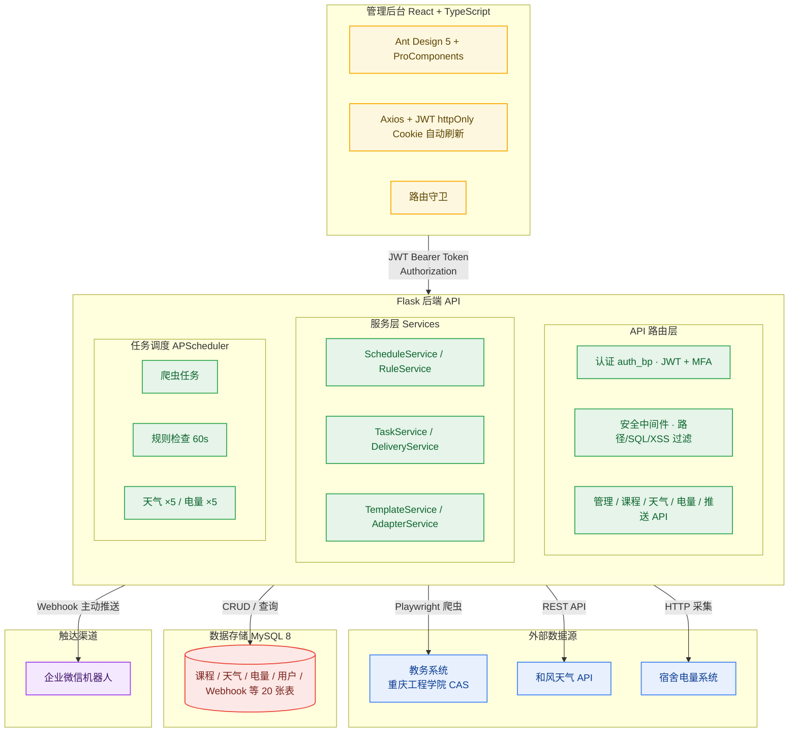
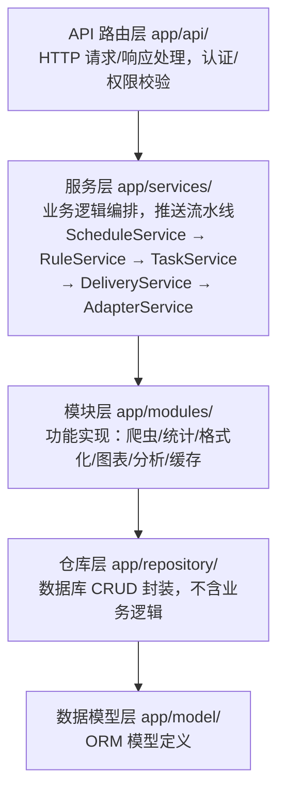
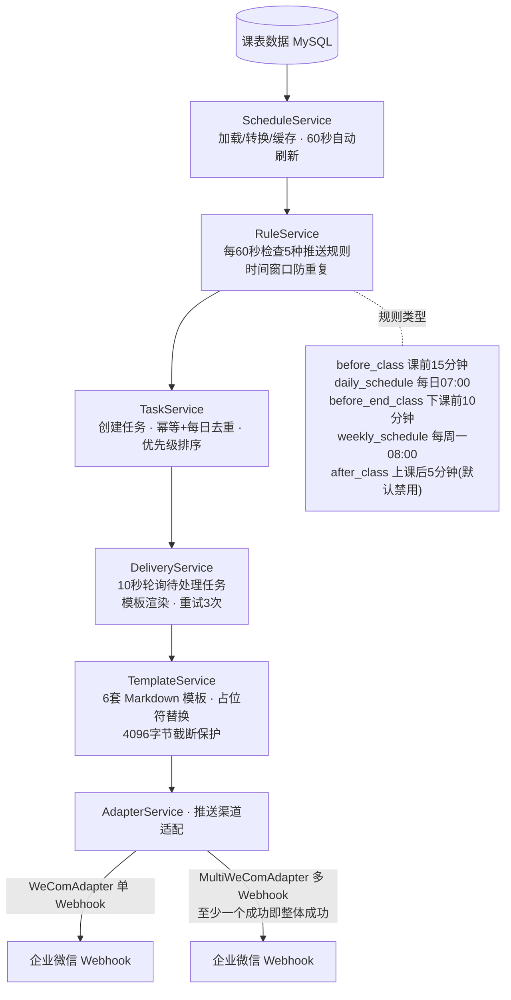
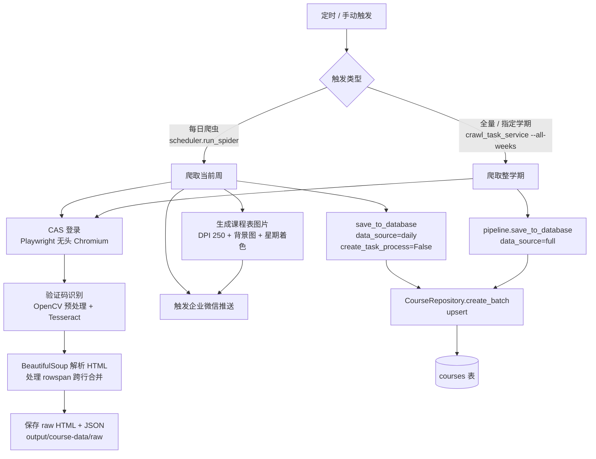
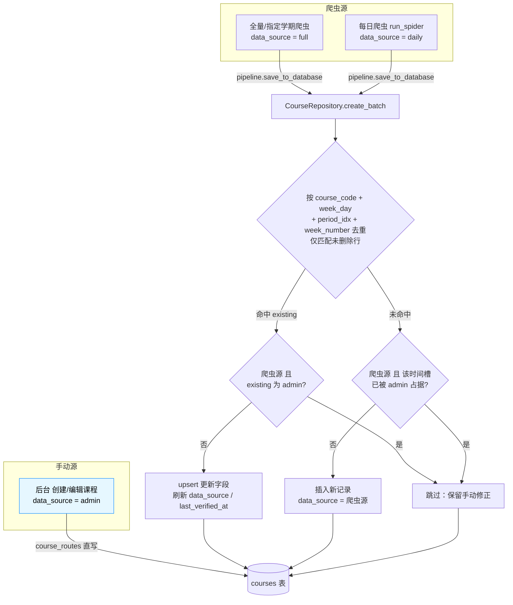
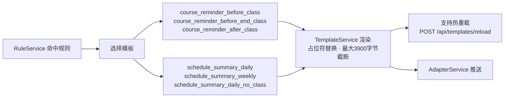
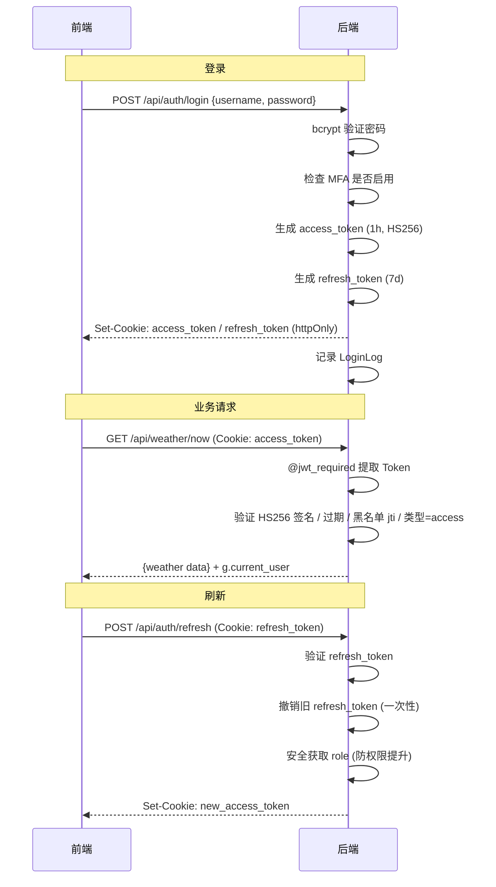
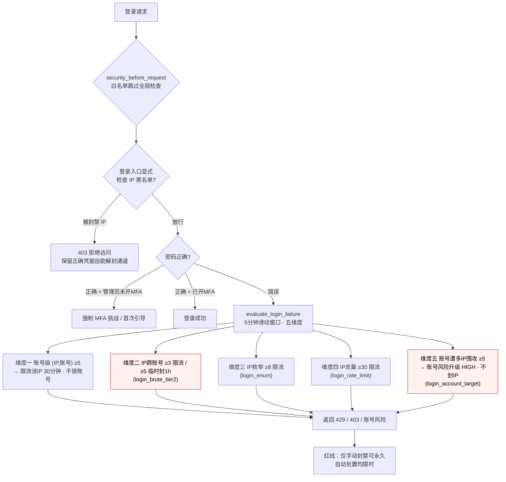
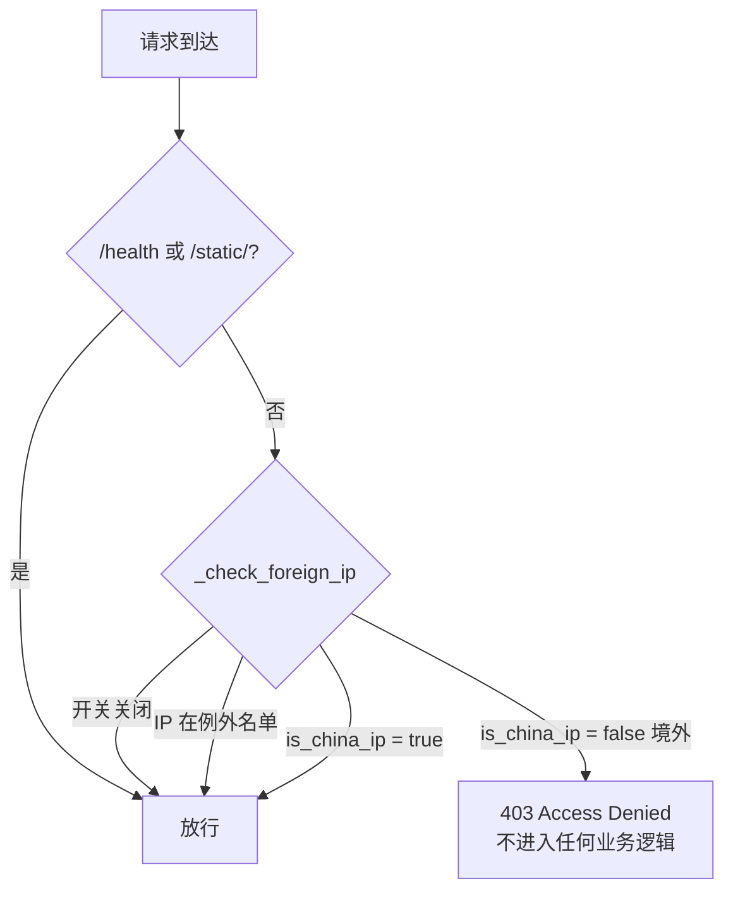

# 校园信息聚合与智能推送系统

> **v6.15.0** | Flask 3.1 + React 19 + TypeScript + Vite + Ant Design 5
>
> 集成课表自动爬取与推送、天气监控与预警、宿舍电量管理三大核心模块，通过企业微信 Webhook 实现消息推送，提供 React + Ant Design Pro 管理后台。

---

## 目录

- [功能特性](#功能特性)
- [系统架构](#系统架构)
- [技术栈](#技术栈)
- [项目结构](#项目结构)
- [快速开始](#快速开始)
- [环境变量配置](#环境变量配置)
- [API 接口文档](#api-接口文档)
- [管理后台](#管理后台)
- [核心模块详解](#核心模块详解)
- [数据库模型](#数据库模型)
- [安全机制](#安全机制)
- [部署指南](#部署指南)
- [更新日志](#更新日志)

---

## 功能特性

### 课表推送模块

- **自动化数据采集**：基于 Playwright 无头浏览器自动登录重庆工程学院 CAS 统一认证系统，使用 Tesseract OCR 识别验证码，自动爬取教务系统课程表
- **智能推送规则引擎**：内置 5 种推送规则（课前提醒、每日课表、下课提醒、周课表图片推送、课后确认），支持按节次自动匹配教学楼时间表（两套时间方案，覆盖 11 栋教学楼）
- **企业微信推送**：支持 Markdown 格式消息和图片消息，6 套可配置消息模板（`{{占位符}}` 语法），模板支持热重载
- **定时自动爬取**：可配置 Cron 表达式定时执行爬虫，支持重试机制（3 次、30 秒间隔）和超时保护（600 秒）
- **数据入库管道**：爬取数据经 `pipeline.py` 处理后由 `CourseRepository.create_batch()` 批量写入 MySQL。按 `course_code + week_day + period_idx + week_number` 去重（仅匹配未删除行），命中即更新、未命中即插入，**从不做删除**。每条记录带 `data_source`（来源标记）与 `last_verified_at`（最后校验时间）；后台手动新增/编辑的课程打 `admin` 标记，爬虫来源（`full`/`daily`）**不会覆盖或挤占**手动课（详见「课表爬虫子系统」）。注意：软删除的课程在去重查询中被忽略，下次爬虫会重新插入该时间槽——即后台"删除"仅在爬虫源也已无此课时才持久生效。
- **课程表图片生成**：自动生成课程表 PNG 图片（DPI 250），支持背景图和按星期着色，每周一生成周课表图片推送
- **手动管理**：支持课程的手动创建、编辑、软删除、恢复、推送开关切换，以及从爬虫 JSON 文件导入

### 天气监控模块

- **实时天气**：每 30 分钟自动更新，采集温度、体感温度、湿度、风向、风力、能见度、降水量等数据
- **24 小时逐时预报**：每 60 分钟更新逐小时天气预报，含温度、降水概率、湿度变化
- **天气预警**：每 10 分钟检查气象台预警，新预警即时推送，按严重程度排序（红 > 橙 > 黄 > 蓝）
- **智能分析引擎**：降雨检测（大雨/普通降雨独立冷却）、高温提醒（体感温度 >= 35 度）、降温提醒（温差 >= 6 度）、预警分级推送
- **冷却机制**：不同事件类型使用独立冷却键（大雨 4h、降雨 3h、高温 6h、降温 6h、预警 1h），冷却状态持久化到磁盘
- **每日晨报**：定时推送当日天气概况、温度范围、降雨概率、出行提示
- **和风天气 API 认证**：支持 Ed25519 (EdDSA) JWT 签名认证和传统 API Key 两种模式
- **异步刷新策略**：数据过期时先返回旧数据，后台线程异步刷新，不阻塞用户请求

### 电量管理模块

- **电量自动爬取**：从重庆工程学院电表系统 (dk.cqie.cn) 爬取用电记录和剩余电量，支持 JSON 和 HTML 双解析方案
- **低电量告警**：三级告警（紧急 <= 5 度、警告 <= 8 度、提醒 <= 10 度），可配置阈值和检测间隔（默认 4 小时）
- **定期报告**：每日/每周/每月用电报告，含 matplotlib 统计图表（折线图、饼图、柱状图）
- **Cookie 管理**：支持运行时动态更新 Cookie，定时自动检测有效性（默认每天 20:00），失效时推送通知
- **容量管理**：自动检测充值事件（电量增加超过 5 度阈值），记录总量变化历史
- **用电统计**：支持按日/周/月维度聚合统计，按电表分组，前端 ECharts 可视化展示

### 管理后台

- **React + Ant Design Pro 前端**：基于 React 19 + TypeScript + Vite 8，使用 ProLayout 侧边栏布局，响应式设计
- **JWT 双 Token 认证**：access_token（1 小时）+ refresh_token（7 天），httpOnly Cookie 存储，前端 Axios 拦截器自动刷新
- **MFA 多因素认证**：基于 TOTP 标准（兼容 Google Authenticator），支持设置、验证、禁用完整流程
- **仪表盘**：系统状态总览（服务状态、模块健康、定时任务）、任务统计（ECharts 饼图）、最近任务时间线、快捷操作按钮
- **模块管理**：天气/电量/课程数据查看与可视化（ECharts 图表）、配置修改、任务手动触发
- **任务进程管理**：查看后台任务执行状态、进度跟踪、手动停止、按类型/状态筛选
- **自定义推送**：支持文本/图片/模板三种消息类型，立即/定时/周期三种推送方式
- **Webhook 管理**：多 Webhook 动态配置，按模块关联，支持启用/禁用和连通性测试
- **用户管理**：管理员可创建/编辑/删除用户、重置密码、重置 MFA，所有用户可查看登录日志
- **模块配置管理**：30+ 条可配置项，覆盖 5 个模块，支持热更新（修改后自动写入 .env、重载 Config、重新注册定时任务）
- **服务器离线检测**：全局 ServerStatusProvider 监听网络状态，离线时全屏红色遮罩提示，恢复后自动探测

### 安全机制

- **JWT 双 Token 认证**：access_token（1h）+ refresh_token（7d），HS256 签名，Token 撤销黑名单（jti + SHA256 哈希）
- **bcrypt 密码哈希**：密码安全存储，首次启动自动从 ADMIN_TOKEN 生成
- **三级认证装饰器**：公开端点（无装饰器）、`@jwt_required`（登录即可）、`@admin_required`（管理员权限）
- **MFA 多因素认证**：TOTP 算法（HMAC-SHA1 + 动态截断，RFC 6238），30 秒步长，前后各 1 窗口容错
- **全面请求安全检查**：`@path_security_check` 装饰器，包含 HTTP 方法验证、请求大小限制（10MB）、40+ 敏感路径黑名单、路径遍历/空字节拦截、SQL 注入检测（30+ 规则）、XSS 攻击检测（30+ 规则）
- **API 智能限流**：Flask-Limiter，4 种限流级别（strict/moderate/lenient/burst），身份感知限流（已认证用户基于用户 ID，未认证基于 IP）
- **安全响应头**：X-Content-Type-Options、X-Frame-Options、X-XSS-Protection、Content-Security-Policy、Strict-Transport-Security、Referrer-Policy、Permissions-Policy
- **CORS 白名单**：可配置允许的跨域域名列表
- **敏感信息脱敏**：管理后台 API 返回的 API Key、Cookie 均做脱敏处理
- **登录安全**：完整登录日志审计（IP、User-Agent、成功/失败/登出时间），密码修改需验证旧密码
- **境外 IP 防火墙（v6.13.0）**：基于本地 ip2region 离线库判定客户端 IP 所属国家，仅允许中国 IP 访问（含登录入口）；命中境外立即返回 403，不进入任何业务逻辑。支持开关与例外 IP/CIDR 白名单（防自锁）

---

## 系统架构



### 后端分层架构



---

## 技术栈

### 后端

| 组件         | 技术                     | 版本               | 说明                             |
| ------------ | ------------------------ | ------------------ | -------------------------------- |
| Web 框架     | Flask                    | 3.1.0              | 应用工厂模式 + Blueprint         |
| 跨域支持     | flask-cors               | 5.0.1              | 可配置 CORS 白名单               |
| API 限流     | Flask-Limiter            | 3.12               | 4 级限流策略                     |
| ORM          | SQLAlchemy               | 2.0.35             | 连接池 + 自动建库建表            |
| 数据库驱动   | pymysql                  | 1.1.1              | MySQL（代码仅支持 MySQL，无 SQLite 回退） |
| 定时任务     | APScheduler              | 3.10.4             | 13+ 个定时任务                   |
| 浏览器自动化 | Playwright               | >=1.40.0           | 教务系统爬虫                     |
| OCR 识别     | Tesseract + pytesseract  | 0.3.13             | 验证码识别                       |
| 图像处理     | Pillow + opencv-python   | 11.0.0 / 4.12.0.88 | 验证码预处理、课程表图片生成     |
| JWT 认证     | PyJWT                    | 2.10.1             | HS256 签名，双 Token 机制        |
| 密码哈希     | bcrypt                   | 4.2.1              | 安全密码存储                     |
| MFA 认证     | 自实现 TOTP              | --                 | RFC 6238 兼容                    |
| HTTP 请求    | requests                 | 2.32.0             | 天气 API / 电表系统              |
| 数据处理     | pandas + numpy           | 2.3.0 / 2.2.6      | 用电统计分析                     |
| 图表生成     | matplotlib               | 3.9.2              | 用电趋势图（折线图/饼图/柱状图） |
| HTML 解析    | beautifulsoup4 + lxml    | 4.12.0 / 5.3.0     | 电表页面解析、课表 HTML 解析     |
| 环境变量     | python-dotenv            | 1.0.1              | .env 文件加载                    |
| 日志         | loguru                   | 0.7.2              | 结构化日志（控制台 + 文件轮转）  |
| 加密         | cryptography             | 44.0.0             | Ed25519 JWT 签名（和风天气认证） |
| 二维码       | qrcode                   | 8.0                | MFA 设置二维码生成               |
| 缓存/限流存储 | Redis                    | 8.0.1              | Flask-Limiter 限流计数 + 登录爆破滑动窗口；未配 REDIS_URL 时降级进程内存 |

### 前端（管理后台）

| 组件        | 技术                        | 版本    | 说明                     |
| ----------- | --------------------------- | ------- | ------------------------ |
| 框架        | React                       | 19.2.x  | 函数组件 + Hooks         |
| 语言        | TypeScript                  | 6.0.x   | 类型安全                 |
| 构建工具    | Vite                        | 8.0.x   | 快速构建 + HMR           |
| UI 组件库   | Ant Design                  | 5.29.x  | 企业级 UI                |
| Pro 组件    | @ant-design/pro-components  | 2.7.x   | ProLayout / ProCard 等   |
| 图表库      | ECharts + echarts-for-react | 6.1.x   | 天气/电量/任务数据可视化 |
| 路由        | react-router-dom            | 7.16.x  | 嵌套路由 + 守卫          |
| HTTP 客户端 | Axios                       | 1.16.x  | 拦截器 + Token 自动刷新  |
| 日期处理    | Day.js                      | 1.11.x  | 轻量日期库               |

---

## 项目结构

```
Push_System_Flask/
|
|-- app/                                  # Flask 应用主包
|   |-- __init__.py                       # 应用工厂 (create_app)
|   |                                     #   - 加载配置、日志、CORS、限流
|   |                                     #   - 初始化数据库、JWT 管理器
|   |                                     #   - 注册 11 个蓝图
|   |                                     #   - 启动服务层和调度器
|   |                                     #   - 初始化默认配置和管理员账号
|   |                                     #   - 清理僵尸进程
|   |
|   |-- api/                              # API 路由蓝图 (11 个)
|   |   |-- routes.py                     # 核心课表推送 API (api_bp -> /api)
|   |   |                                 #   13 个端点: 服务信息/健康检查/系统状态
|   |   |                                 #   课表查询/推送规则/任务统计/模板/爬虫
|   |   |-- auth_routes.py                # JWT 认证 API (auth_bp -> /api/auth)
|   |   |                                 #   10 个端点: 登录/MFA验证/刷新/登出
|   |   |                                 #   用户信息/修改密码/MFA设置验证禁用状态
|   |   |-- admin_routes.py               # 管理后台 API (admin_bp -> /api/admin)
|   |   |                                 #   仪表盘/天气配置与触发/电量配置与触发
|   |   |                                 #   课程推送/爬虫任务/系统配置与热重载
|   |   |-- admin_user_routes.py          # 用户管理 API (admin_user_bp -> /api/admin/user)
|   |   |                                 #   个人信息/登录日志/用户CRUD/密码重置
|   |   |-- course_routes.py              # 课程管理 API (course_bp -> /api/course)
|   |   |                                 #   课程列表/图形化课表/创建/编辑/删除
|   |   |                                 #   推送开关/从JSON导入
|   |   |-- push_routes.py                # 自定义推送 API (push_bp -> /api/admin/push)
|   |   |                                 #   推送CRUD/立即发送/取消/模板列表
|   |   |-- process_routes.py             # 任务进程管理 API (process_bp -> /api/admin/processes)
|   |   |                                 #   进程列表/运行中/定时计划/停止/删除
|   |   |-- config_routes.py              # 模块配置 API (config_bp -> /api/admin/config)
|   |   |                                 #   配置CRUD/初始化默认/模式定义
|   |   |-- webhook_routes.py             # Webhook 管理 API (webhook_bp -> /api/admin/webhooks)
|   |   |                                 #   Webhook CRUD/测试/重载适配器
|   |   |-- weather_routes.py             # 天气模块 API (weather_bp -> /api/weather)
|   |   |                                 #   实时天气/逐时预报/预警/统计/手动触发
|   |   |-- electricity_routes.py         # 电量模块 API (electricity_bp -> /api/electricity)
|   |                                     #   剩余电量/用电记录/统计/配置/触发
|   |
|   |-- core/                             # 核心基础模块
|   |   |-- config.py                     # 配置管理中心
|   |   |                                 #   - 从 .env 加载环境变量（详见「环境变量配置」章节）
|   |   |                                 #   - 启动时验证 SECRET_KEY/ADMIN_TOKEN
|   |   |                                 #   - 支持 reload() 动态重载
|   |   |                                 #   - 自动检测 Tesseract 路径
|   |   |                                 #   - 仅支持 MySQL 数据库后端（无 SQLite）
|   |   |-- database.py                   # 数据库管理 (SQLAlchemy ORM)
|   |   |                                 #   - DatabaseManager 单例模式
|   |   |                                 #   - MySQL 自动建库 + 连接池
|   |   |                                 #   - MySQL 连接池 + 自动建库
|   |   |                                 #   - get_db_session() 依赖注入
|   |   |-- logger.py                     # 日志系统 (loguru)
|   |   |                                 #   - GlobalLogger 单例
|   |   |                                 #   - 控制台 + 文件双输出
|   |   |                                 #   - RotatingFileHandler (10MB x 5)
|   |   |-- extensions.py                 # Flask 扩展实例
|   |                                     #   - flask_limiter.Limiter
|   |
|   |-- model/                            # 数据模型层 (13 个模型)
|   |   |-- __init__.py                   # 统一导出所有模型
|   |   |-- user.py                       # User - 用户表
|   |   |-- user_mfa.py                   # UserMFA - MFA 配置表
|   |   |-- login_log.py                  # LoginLog - 登录日志表
|   |   |-- token_blacklist.py            # TokenBlacklist - Token 黑名单表
|   |   |-- weather.py                    # WeatherRecord + WeatherAlert - 天气数据表
|   |   |-- electricity.py                # ElectricityRecord + ElectricityRemaining
|   |   |                                 #   + ElectricityTotalCapacity - 电量数据表
|   |   |-- course.py                     # Course - 课程表 (支持软删除)
|   |   |-- custom_push.py                # CustomPush - 自定义推送表
|   |   |-- task_process.py               # TaskProcess - 任务进程表
|   |   |-- module_config.py              # ModuleConfig - 模块配置表 (30+ 默认配置)
|   |   |-- webhook.py                    # Webhook - Webhook 配置表
|   |
|   |-- repository/                       # 仓库层 (数据访问封装)
|   |   |-- course_repository.py          # 课程数据 CRUD (批量创建/去重/软删除/恢复)
|   |   |-- electricity_repository.py     # 电量数据 CRUD (记录/剩余/容量)
|   |   |-- weather_repository.py         # 天气数据 CRUD (实时/逐时/预警)
|   |
|   |-- service/                          # 业务服务层
|   |   |-- electricity_service.py        # 电量业务 (爬取/保存/统计/低电量检测)
|   |   |-- weather_service.py            # 天气业务 (采集/保存/过期刷新)
|   |
|   |-- services/                         # 课表推送服务层
|   |   |-- schedule_service.py           # 课表数据管理 (加载/转换/缓存/自动刷新)
|   |   |-- rule_service.py               # 推送规则引擎 (5 种规则/时间窗口/优先级)
|   |   |-- task_service.py               # 推送任务管理 (幂等/去重/优先级/重试)
|   |   |-- delivery_service.py           # 推送执行引擎 (10秒轮询/模板渲染/重试)
|   |   |-- template_service.py           # 消息模板管理 (JSON 模板/热重载/截断保护)
|   |   |-- adapter_service.py            # 推送渠道适配器
|   |   |                                 #   BaseAdapter -> WeComAdapter
|   |   |                                 #   MultiWeComAdapter (多 Webhook)
|   |   |                                 #   数据库优先加载, .env 回退
|   |   |-- templates.json                # 6 个消息模板配置
|   |   |-- geo_service.py                # IP 地理解析（境外防火墙用，基于 ip2region 离线库）
|   |   |-- ip_blacklist_service.py        # IP 黑名单 / 登录爆破滑动窗口（Redis 或内存降级）
|   |
|   |-- modules/                          # 功能模块
|   |   |-- weather/                      # 天气监控子模块
|   |   |   |-- fetcher.py                # 和风天气 API 封装
|   |   |   |                             #   - Ed25519 JWT 签名认证
|   |   |   |                             #   - fetch_now/hourly/alert
|   |   |   |-- tasks.py                  # 5 个定时任务注册
|   |   |   |-- analyzer.py               # 天气分析引擎 (5 种事件/冷却机制)
|   |   |   |-- cache.py                  # 内存 TTL 缓存 (单例/线程安全)
|   |   |   |-- message.py                # 消息格式化 (Markdown)
|   |   |
|   |   |-- electricity/                  # 电量监控子模块
|   |       |-- crawler.py                # 电表系统爬虫 (requests + BeautifulSoup)
|   |       |-- tasks.py                  # 5 个定时任务注册
|   |       |-- formatter.py              # 消息格式化 (Markdown)
|   |       |-- statistics.py             # 用电统计分析
|   |       |-- chart.py                  # matplotlib 图表生成
|   |       |-- capacity_manager.py       # 电量容量管理 (充值检测/总量记录)
|   |
|   |-- tasks/                            # 任务调度
|   |   |-- scheduler.py                  # APScheduler 调度核心
|   |                                     #   - 条件注册 (按配置启用模块)
|   |                                     #   - 爬虫并发锁/重试/超时
|   |                                     #   - 推送规则协调 (爬虫与推送时间冲突处理)
|   |                                     #   - 周课表生成 (新鲜度校验)
|   |
|   |-- utils/                            # 工具模块
|   |   |-- jwt_auth.py                   # JWTManager 类
|   |   |                                 #   - generate_tokens() 双 Token 生成
|   |   |                                 #   - verify_token() 签名+过期+黑名单验证
|   |   |                                 #   - refresh_access_token() 一次性刷新
|   |   |                                 #   - revoke_token() / is_revoked() 撤销
|   |   |                                 #   - cleanup_expired_blacklist() 定期清理
|   |   |-- auth_middleware.py            # 认证装饰器
|   |   |                                 #   - @jwt_required (Header/Cookie 双通道)
|   |   |                                 #   - @admin_required (角色检查)
|   |   |-- security.py                   # 安全中间件
|   |   |                                 #   - path_security_check 路径黑名单
|   |   |                                 #   - SQL 注入/XSS 攻击检测
|   |   |                                 #   - 请求大小限制/方法验证/审计日志
|   |   |-- mfa.py                        # MFA 多因素认证
|   |   |                                 #   - TOTP 类 (HMAC-SHA1, RFC 6238)
|   |   |                                 #   - MFAManager (生成密钥/验证码/URI)
|   |   |-- platform_utils.py             # 跨平台工具
|   |   |                                 #   - 进程管理 (kill_process)
|   |   |                                 #   - Python 路径检测
|   |   |-- token.py                      # 动态 Token 管理
|   |                                     #   - 一次性/IP绑定/短时效安全 Token
|   |
|   |-- cqie-course-timetable/            # 课表爬虫子项目
|       |-- main.py                       # 爬虫主程序 (整合版)
|       |-- spider.py                     # Playwright 爬虫 (登录/抓取/解析)
|       |-- captcha.py                    # 验证码识别 (OpenCV + Tesseract)
|       |-- pipeline.py                   # 数据处理与入库管道
|       |-- config.py                     # 子项目配置
|       |-- logger.py                     # 子项目日志
|       |-- requirements.txt              # 子项目独立依赖
|       |-- course_processing/            # 课表数据处理
|       |   |-- csv_to_image.py           # CSV 转课程表图片
|       |   |-- process_course_data.py    # 课表数据解析与时间计算
|       |-- output/                       # 爬虫输出目录
|           |-- course-data/
|           |   |-- raw/                  # 原始 HTML/JSON
|           |   |-- processed/            # 处理后 JSON/CSV
|           |   |-- images/               # 课程表图片
|           |   |-- history/              # 历史版本归档
|           |-- logs/                     # 爬虫日志
|
|-- admin-frontend/                       # 管理后台前端
|   |-- package.json                      # Node 依赖
|   |-- vite.config.ts                    # Vite 配置
|   |                                     #   - /api 代理到 localhost:29528
|   |                                     #   - @ 别名指向 src/
|   |-- tsconfig.json                     # TypeScript 配置
|   |-- index.html                        # HTML 入口
|   |-- public/                           # 静态资源
|   |   |-- favicon.svg                   # 网站图标
|   |   |-- icons.svg                     # 图标精灵图
|   |   |-- weather-icons.png             # 天气图标精灵图
|   |-- src/
|       |-- main.tsx                      # React DOM 渲染入口
|       |-- App.tsx                       # 根组件 (路由配置 + Provider 层次)
|       |-- style.css                     # 全局样式
|       |-- api/                          # API 请求层
|       |   |-- request.ts                # Axios 实例 (拦截器/Token刷新/离线检测)
|       |   |-- auth.ts                   # 认证 API (login/MFA/refresh/logout/me)
|       |   |-- admin.ts                  # 管理后台 API (dashboard/config/push/process/webhook/user)
|       |   |-- weather.ts                # 天气 API (now/hourly/alert/statistics)
|       |   |-- electricity.ts            # 电量 API (remaining/records/statistics)
|       |   |-- course.ts                 # 课程 API (list/timetable/CRUD/import)
|       |-- components/                   # 公共组件
|       |   |-- AuthGuard.tsx             # 认证守卫 (未登录 -> /login)
|       |   |-- AdminGuard.tsx            # 管理员守卫 (非管理员 -> /weather)
|       |   |-- ServerStatusProvider.tsx  # 服务器离线检测与提示
|       |   |-- HomeRedirect.tsx          # 首页重定向 (按角色)
|       |   |-- Footer.tsx                # 公共页脚 (备案信息/法律链接)
|       |   |-- ElectricityChart.tsx      # 电量可视化 (折线图/饼图/柱状图)
|       |   |-- WeatherChart.tsx          # 天气可视化 (温度/降水/湿度图表)
|       |-- contexts/
|       |   |-- UserContext.tsx           # 用户认证状态管理 (Context + Hooks)
|       |-- layouts/
|       |   |-- AdminLayout.tsx           # ProLayout 侧边栏布局 (动态菜单)
|       |-- pages/                        # 页面组件
|       |   |-- Login.tsx                 # 登录页 (随机背景/MFA验证码输入)
|       |   |-- Dashboard.tsx             # 仪表盘 (状态卡片/统计/时间线/快捷操作)
|       |   |-- Weather.tsx               # 天气管理
|       |   |-- Electricity.tsx           # 电量管理
|       |   |-- Course.tsx                # 课程管理 (图形化课表/CRUD)
|       |   |-- Tasks.tsx                 # 任务管理 (手动触发)
|       |   |-- Push.tsx                  # 自定义推送
|       |   |-- Processes.tsx             # 进程管理
|       |   |-- Webhooks.tsx              # Webhook 管理
|       |   |-- Settings.tsx              # 系统设置
|       |   |-- UserManagement.tsx        # 用户管理
|       |   |-- Profile.tsx               # 个人设置
|       |   |-- Welcome.tsx               # 欢迎页
|       |-- utils/
|           |-- token.ts                  # Token 工具 (兼容 httpOnly Cookie 迁移)
|
|-- data/                                 # 运行时数据 (自动创建)
|   |-- (MySQL 实例)                      # 运行时数据库为 MySQL（由 DATABASE_* 配置，无本地 SQLite 文件）
|   |-- (无本地 db 文件)                   # 代码仅支持 MySQL，不生成 SQLite 文件
|   |-- auth/
|   |   |-- password.hash                 # bcrypt 密码哈希
|   |-- electricity/
|       |-- charts/                       # 用电统计图表 (PNG)
|       |-- usage_records.json            # 用电记录备份
|       |-- remaining_power.json          # 剩余电量备份
|
|-- logs/                                 # 应用日志 (自动创建)
|   |-- app.log                           # 主日志 (10MB 轮转 x 5)
|
|-- .env                                  # 实际环境变量 (不入库)
|-- .env.example                          # 环境变量模板（详见「环境变量配置」章节）
|-- .env.linux                            # Linux 生产环境模板
|-- .gitignore                            # Git 忽略规则
|-- requirements.txt                      # Python 依赖 (23 个包)
|-- run.py                                # 应用入口
|-- init_db.py                           # 数据库初始化/迁移脚本 (自动建表 + 补列)
|-- docs/                                # 部署与安全文档
|   |-- DEPLOY_LINUX.md                   #   Linux 部署指南
|   |-- DEPLOY_CHECKLIST.md               #   部署检查清单
|   |-- UV_DEPLOY.md                      #   uv 部署方式
|   |-- 安全配置指南.md                    #   安全配置指南
|   `-- 安全配置审计_2026-07-18.md         #   安全配置审计
|-- ed25519-private.pem                   # 和风天气 Ed25519 私钥 (不入库, 用户自生成)
|-- ed25519-public.pem                    # 和风天气 Ed25519 公钥 (不入库)
|-- README.md                             # 本文档
```

---

## 快速开始

### 环境要求

| 依赖          | 版本要求    | 说明                         |
| ------------- | ----------- | ---------------------------- |
| Python        | 3.10+       | 后端运行时                   |
| Node.js       | 18+         | 管理后台开发/构建            |
| MySQL         | 5.7+ / 8.0+ | 生产数据库（仅支持 MySQL，无 SQLite 回退） |
| Redis         | 可选/生产推荐 | Flask-Limiter 限流存储 + 登录爆破滑动窗口；未配置则降级内存（仅单机/开发） |
| Tesseract OCR | 4.x+        | 课表验证码识别               |
| Chromium      | 最新版      | Playwright 浏览器自动化      |

### 安装步骤

```bash
# 1. 克隆项目
git clone <your-repo> Push_System_Flask
cd Push_System_Flask

# 2. 配置环境变量
cp .env.example .env
# 编辑 .env，填写必要的配置 (详见下方「环境变量配置」章节)

# 3. 创建虚拟环境并安装依赖
python -m venv venv
# Windows:
venv\Scripts\activate
# Linux/macOS:
source venv/bin/activate
pip install -r requirements.txt

# 4. 安装 Playwright 浏览器
playwright install chromium
# Linux 额外安装系统依赖:
playwright install-deps chromium

# 5. 安装 Tesseract OCR
# Windows: 下载安装 https://github.com/UB-Mannheim/tesseract/wiki
#   安装后配置 TESSERACT_CMD 环境变量
# Ubuntu/Debian:
sudo apt install -y tesseract-ocr tesseract-ocr-chi-sim
# macOS:
brew install tesseract tesseract-lang

# 6. 配置 MySQL 数据库（必填）
# 在 .env 中设置 DATABASE_HOST / DATABASE_USER / DATABASE_PASSWORD / DATABASE_NAME（默认值见环境变量配置）
# 不配置则使用默认 MySQL 连接（localhost:3306/push_system，账号 root/123456）

# 7. 启动后端
python run.py
# 服务启动在 http://localhost:29528

# 8. 启动管理后台 (开发模式)
cd admin-frontend
npm install
npm run dev
# 前端启动在 http://localhost:5173，自动代理 API 到后端
```

### 登录管理后台

1. 访问 `http://localhost:5173`
2. **用户名**：`admin`（可通过 `JWT_ADMIN_USERNAME` 环境变量配置）
3. **密码**：优先级如下：
   - `JWT_ADMIN_PASSWORD`（如果设置了）
   - `ADMIN_TOKEN`（作为初始登录密码）
   - 首次启动会自动将密码 bcrypt 哈希存储到 `data/auth/password.hash`

> 生产环境（`DEBUG=false`）启动时要求 `SECRET_KEY`（32 位以上）必须配置，否则应用拒绝启动；`ADMIN_TOKEN`（16 位以上）同样必填。敏感配置均通过环境变量管理，不硬编码。

---

## 环境变量配置

所有配置通过项目根目录 `.env` 文件管理，参考 `.env.example`（详见「环境变量配置」章节）。系统支持通过管理后台在线修改大部分配置，修改后自动写入 `.env` 文件并热重载。

### 必须配置

| 变量            | 说明                                             | 示例                                                       |
| --------------- | ------------------------------------------------ | ---------------------------------------------------------- |
| `SECRET_KEY`    | JWT 签名密钥（32 位以上随机字符串）              | `my-super-secret-key-32chars!!`                            |

> **安全约定**：敏感配置（密钥、令牌、Cookie 等）一律通过环境变量管理，**不硬编码**到源码。
> `SECRET_KEY` 必须来自 `.env`（`python -c "import secrets;print(secrets.token_hex(48))"` 生成）。
> 生产环境（`DEBUG=false`）若未配置 `SECRET_KEY`，应用**启动即失败**（避免重启即全员下线、多实例密钥不一致）。
| `ADMIN_TOKEN`   | 管理令牌（16 位以上，也作为初始登录密码）        | `my-admin-token-16chars!`                                  |
| `WECOM_WEBHOOK` | 企业微信机器人 Webhook URL（支持多个，逗号分隔） | `https://qyapi.weixin.qq.com/cgi-bin/webhook/send?key=xxx` |

### 应用基础配置

| 变量          | 默认值                       | 说明                             |
| ------------- | ---------------------------- | -------------------------------- |
| `APP_NAME`    | `校园信息聚合与智能推送系统` | 应用名称                         |
| `APP_VERSION` | `6.15.0`                     | 应用版本                         |
| `DEBUG`       | `false`                      | 调试模式（生产环境必须为 false） |
| `HOST`        | `0.0.0.0`                    | 监听地址                         |
| `PORT`        | `29528`                      | 监听端口                         |

### 数据库配置

> 代码仅支持 MySQL（`config.py` 读 `DATABASE_*` 而非 `DATABASE_URL`，无 SQLite 回退）。

| 变量                | 默认值         | 说明                          |
| ------------------- | -------------- | ----------------------------- |
| `DATABASE_HOST`     | `localhost`    | MySQL 主机                    |
| `DATABASE_PORT`     | `3306`         | MySQL 端口                    |
| `DATABASE_USER`     | `root`         | MySQL 用户名                  |
| `DATABASE_PASSWORD` | `123456`       | MySQL 密码（生产务必改强密码）|
| `DATABASE_NAME`     | `push_system`  | 数据库名                      |

### JWT 认证配置

| 变量                       | 默认值   | 说明                                       |
| -------------------------- | -------- | ------------------------------------------ |
| `JWT_ADMIN_USERNAME`       | `admin`  | 管理后台登录用户名                         |
| `JWT_ADMIN_PASSWORD`       | （空）   | 管理后台登录密码，为空则使用 `ADMIN_TOKEN` |
| `JWT_ACCESS_TOKEN_EXPIRE`  | `3600`   | Access Token 有效期（秒），默认 1 小时     |
| `JWT_REFRESH_TOKEN_EXPIRE` | `604800` | Refresh Token 有效期（秒），默认 7 天      |

### 天气模块配置

| 变量                      | 默认值                        | 说明                                      |
| ------------------------- | ----------------------------- | ----------------------------------------- |
| `QWEATHER_API_KEY`        | （空）                        | 和风天气 API Key（免费版认证）            |
| `QWEATHER_CREDENTIAL_ID`  | （空）                        | 和风天气凭证 ID（Ed25519 认证，付费版）   |
| `QWEATHER_API_HOST`       | `https://devapi.qweather.com` | API 域名（免费版 devapi，付费版 api）     |
| `QWEATHER_LOCATION`       | `101040100`                   | 城市 LocationID（可在和风天气控制台查询） |
| `QWEATHER_LATITUDE`       | `29.56`                       | 纬度（预警 API 使用）                     |
| `QWEATHER_LONGITUDE`      | `106.55`                      | 经度（预警 API 使用）                     |
| `QWEATHER_CITY_NAME`      | `重庆`                        | 城市名称（推送消息显示用）                |
| `QWEATHER_SCHEDULE_DAILY` | `07:00`                       | 每日天气晨报推送时间                      |

### 电量模块配置

| 变量                                   | 默认值              | 说明                              |
| -------------------------------------- | ------------------- | --------------------------------- |
| `ELECTRICITY_CRAWLER_COOKIE`           | （空）              | 电表系统 Cookie（从浏览器获取）   |
| `ELECTRICITY_CRAWLER_BASE_URL`         | `http://dk.cqie.cn` | 电表系统 URL                      |
| `ELECTRICITY_CRAWLER_MAX_PAGES`        | `2`                 | 每次爬取最大页数                  |
| `ELECTRICITY_LOW_POWER_THRESHOLD`      | `10.0`              | 低电量告警阈值（度）              |
| `ELECTRICITY_LOW_POWER_INTERVAL_HOURS` | `4.0`               | 低电量告警最小间隔（小时）        |
| `ELECTRICITY_SCHEDULE_DAILY`           | `00:30`             | 每日用电报告推送时间              |
| `ELECTRICITY_SCHEDULE_WEEKLY`          | `00:30`             | 每周用电报告推送时间              |
| `ELECTRICITY_SCHEDULE_WEEKLY_DAY`      | `mon`               | 每周报告推送日（mon/tue/.../sun） |
| `ELECTRICITY_SCHEDULE_MONTHLY`         | `00:30`             | 每月用电报告推送时间              |
| `ELECTRICITY_SCHEDULE_MONTHLY_DAY`     | `1`                 | 每月报告推送日（1-28）            |
| `ELECTRICITY_COOKIE_CHECK_TIME`        | `20:00`             | Cookie 有效性检测时间             |

### 课表推送配置

| 变量                       | 默认值         | 说明                                   |
| -------------------------- | -------------- | -------------------------------------- |
| `CLASS_NAME`               | `ZK2401`       | 班级名称                               |
| `CRON_EXPRESSION`          | `0 7,13 * * *` | 爬虫 Cron 表达式（每天 7:00 和 13:00） |
| `DAILY_PUSH_TIME`          | `07:00`        | 每日课表推送时间                       |
| `BEFORE_CLASS_MINUTES`     | `15`           | 课前提醒提前分钟数                     |
| `BEFORE_END_CLASS_MINUTES` | `10`           | 下课提醒提前分钟数                     |
| `JWXT_USERNAME`            | （空）         | 教务系统用户名                         |
| `JWXT_PASSWORD`            | （空）         | 教务系统密码                           |
| `JWXT_HEADLESS`            | `true`         | 无头浏览器模式                         |
| `JWXT_TIMEOUT`             | `180`          | 爬虫超时（秒）                         |
| `JWXT_SAVE_LOG`            | `true`         | 是否保存爬虫日志                       |
| `JWXT_CAPTCHA_MODE`        | `auto`         | 验证码模式（auto/manual）              |
| `SPIDER_HEADLESS`          | `true`         | 爬虫无头模式开关                       |

### 安全与跨域配置

| 变量              | 默认值                                         | 说明                                                                     |
| ----------------- | ---------------------------------------------- | ------------------------------------------------------------------------ |
| `AUTH_ENABLED`    | `true`                                         | 是否启用认证                                                             |
| `ALLOWED_ORIGINS` | `http://localhost:29528,http://localhost:5173` | 允许的跨域域名（逗号分隔；生产务必改为真实域名，兼容旧名 `CORS_ORIGINS`） |
| `FORCE_ADMIN_MFA` | `true`                                         | 强制管理员启用多因素认证(MFA)；首次引导（系统内尚无任何 MFA 用户）时放行 |
| `REDIS_URL`       | （空）                                         | 限流计数与登录爆破滑动窗口的存储；为空则使用进程内内存（仅单机/开发，多 worker 或重启会丢失限流状态） |
| `ENABLE_FOREIGN_IP_BLOCK` | `true`                              | 境外 IP 防火墙开关；开启后仅允许中国 IP 访问（含登录入口），命中境外返回 403 |
| `REGION_BLOCK_EXCEPTIONS` | （空）                              | 例外 IP/CIDR 白名单（逗号分隔），命中的 IP 不受境外拦截限制（防自锁，如管理出口或 VPN） |

### 企业微信配置

| 变量                   | 默认值 | 说明                                     |
| ---------------------- | ------ | ---------------------------------------- |
| `WECOM_WEBHOOK`        | （空） | 主推送 Webhook URL（支持多个，逗号分隔） |
| `WECOM_STATUS_WEBHOOK` | （空） | 状态通知专用 Webhook（可选）             |

### 其他配置

| 变量            | 默认值   | 说明                                     |
| --------------- | -------- | ---------------------------------------- |
| `PYTHON_PATH`   | `python` | Python 可执行文件路径（爬虫子进程使用）  |
| `TESSERACT_CMD` | （空）   | Tesseract 可执行文件路径（空则自动检测） |

---

## API 接口文档

### 认证方式

所有 API 使用 **JWT Bearer Token** 认证（健康检查等公开端点除外）。Token 通过 httpOnly Cookie 自动传递，也可手动附加到请求头：

```
Authorization: Bearer <access_token>
```

**认证级别说明：**

| 装饰器            | 说明               | 适用场景                     |
| ----------------- | ------------------ | ---------------------------- |
| 无装饰器          | 公开端点，无需认证 | 健康检查、登录、MFA 验证     |
| `@jwt_required`   | 需要登录           | 数据查询、手动触发、个人信息 |
| `@admin_required` | 需要管理员权限     | 配置修改、系统管理、用户管理 |

**Token 刷新流程：**

```
1. 请求返回 401 -> 前端自动使用 refresh_token (httpOnly Cookie) 调用 /api/auth/refresh
2. 刷新成功 -> 后端设置新 access_token Cookie -> 前端自动重发原请求
3. 刷新失败 -> 前端进入 10 秒冷却期 -> 跳转登录页
4. 并发请求处理 -> 多个 401 只触发一次刷新，其余请求排队等待
```

---

### 认证 API -- `/api/auth`

| 端点                        | 方法 | 认证            | 说明                                                                     |
| --------------------------- | ---- | --------------- | ------------------------------------------------------------------------ |
| `/api/auth/login`           | POST | 无              | 管理员登录。支持 MFA：若启用则返回 `mfa_required` 状态和临时 `mfa_token` |
| `/api/auth/login/mfa`       | POST | 无              | MFA 验证登录。验证临时 token + TOTP 6 位码                               |
| `/api/auth/refresh`         | POST | 无              | 用 refresh_token 换新 access_token                                       |
| `/api/auth/logout`          | POST | `@jwt_required` | 撤销当前 Token，记录登出时间，清除 Cookie                                |
| `/api/auth/me`              | GET  | `@jwt_required` | 获取当前登录用户信息                                                     |
| `/api/auth/change-password` | POST | `@jwt_required` | 修改密码（需验证旧密码，新密码最少 6 位）                                |
| `/api/auth/mfa/setup`       | POST | `@jwt_required` | 设置 MFA（生成密钥 + provisioning URI + 二维码 Base64）                  |
| `/api/auth/mfa/verify`      | POST | `@jwt_required` | 验证 MFA 代码并启用                                                      |
| `/api/auth/mfa/disable`     | POST | `@jwt_required` | 禁用 MFA（需提供当前 MFA 代码）                                          |
| `/api/auth/mfa/status`      | GET  | `@jwt_required` | 获取 MFA 启用状态                                                        |

**登录请求：**

```json
POST /api/auth/login
{
  "username": "admin",
  "password": "your-password"
}
```

**登录响应（正常）：**

```json
{
  "status": "success",
  "access_token": "eyJhbGciOiJIUzI1NiIs...",
  "refresh_token": "eyJhbGciOiJIUzI1NiIs...",
  "expires_in": 3600,
  "user": {
    "id": 1,
    "username": "admin",
    "role": "admin"
  }
}
```

**登录响应（需 MFA）：**

```json
{
  "status": "mfa_required",
  "mfa_token": "temporary-token-for-mfa-verification"
}
```

---

### 核心课表 API -- `/api`

| 端点                        | 方法 | 认证              | 说明                                                      | 参数                 |
| --------------------------- | ---- | ----------------- | --------------------------------------------------------- | -------------------- |
| `/api/`                     | GET  | 无                | 服务信息，返回版本和端点索引                              | --                   |
| `/api/ping`                 | GET  | 无                | 健康检查（轻量级）                                        | --                   |
| `/api/health`               | GET  | 无                | 健康检查（含服务状态详情）                                | --                   |
| `/api/status`               | GET  | `@jwt_required`   | 系统状态（认证开关、数据就绪、课表/任务统计、适配器状态） | --                   |
| `/api/trigger`              | POST | `@jwt_required`   | 手动触发推送                                              | `?force=false&type=` |
| `/api/schedules`            | GET  | `@jwt_required`   | 获取完整课表                                              | `?force=false`       |
| `/api/schedules/today`      | GET  | `@jwt_required`   | 获取今日课表                                              | --                   |
| `/api/schedules/statistics` | GET  | `@jwt_required`   | 获取课表统计                                              | --                   |
| `/api/rules`                | GET  | `@jwt_required`   | 获取推送规则列表                                          | --                   |
| `/api/tasks`                | GET  | `@jwt_required`   | 获取任务统计                                              | --                   |
| `/api/templates`            | GET  | `@jwt_required`   | 获取消息模板                                              | --                   |
| `/api/templates/reload`     | POST | `@admin_required` | 重新加载模板配置文件                                      | --                   |
| `/api/spider/run`           | POST | `@admin_required` | 手动触发课表爬虫（异步线程，运行中返回 409）              | --                   |
| `/api/spider/status`        | GET  | `@jwt_required`   | 查询爬虫执行状态                                          | --                   |

---

### 课程管理 API -- `/api/course`

| 端点                           | 方法   | 认证              | 说明                                                      |
| ------------------------------ | ------ | ----------------- | --------------------------------------------------------- |
| `/api/course/list`             | GET    | `@jwt_required`   | 获取课程列表（支持按星期/周次筛选，自动合并同课程多节次） |
| `/api/course/timetable`        | GET    | `@jwt_required`   | 获取图形化课表数据（含节次时间表、当前上课状态）          |
| `/api/course`                  | POST   | `@admin_required` | 创建课程（支持多节次，自动填充时间）                      |
| `/api/course/<id>`             | PUT    | `@admin_required` | 更新课程信息                                              |
| `/api/course/<id>`             | DELETE | `@admin_required` | 软删除课程（爬虫不会覆盖）                                |
| `/api/course/<id>/toggle-push` | POST   | `@admin_required` | 切换课程推送提醒开关                                      |
| `/api/course/import`           | POST   | `@admin_required` | 从爬虫 JSON 文件导入课程                                  |

---

### 天气 API -- `/api/weather`

| 端点                                 | 方法 | 认证              | 说明                                               |
| ------------------------------------ | ---- | ----------------- | -------------------------------------------------- |
| `/api/weather/health`                | GET  | 无                | 天气模块健康检查                                   |
| `/api/weather/status`                | GET  | `@admin_required` | 天气模块状态（API 配置、位置、推送时间、冷却状态） |
| `/api/weather/now`                   | GET  | `@jwt_required`   | 获取实时天气（优先数据库，过期 30 分钟则异步刷新） |
| `/api/weather/hourly`                | GET  | `@jwt_required`   | 获取 24 小时逐时预报                               |
| `/api/weather/alert`                 | GET  | `@jwt_required`   | 获取天气预警（数据库无数据时自动从 API 获取）      |
| `/api/weather/statistics`            | GET  | `@jwt_required`   | 获取天气统计（实时 + 24h 预报汇总）                |
| `/api/weather/trigger/daily`         | POST | `@admin_required` | 手动触发每日天气晨报                               |
| `/api/weather/trigger/update_now`    | POST | `@admin_required` | 手动触发实时天气更新                               |
| `/api/weather/trigger/update_hourly` | POST | `@admin_required` | 手动触发 24h 预报更新                              |
| `/api/weather/trigger/check_alerts`  | POST | `@admin_required` | 手动触发天气预警检查                               |

---

### 电量 API -- `/api/electricity`

| 端点                                    | 方法   | 认证              | 说明                                             |
| --------------------------------------- | ------ | ----------------- | ------------------------------------------------ |
| `/api/electricity/health`               | GET    | 无                | 电量模块健康检查                                 |
| `/api/electricity/status`               | GET    | `@admin_required` | 电量模块状态（Cookie 配置、数据存在、配置信息）  |
| `/api/electricity/remaining`            | GET    | `@jwt_required`   | 获取最新剩余电量（含百分比、总量、低电量标志）   |
| `/api/electricity/records`              | GET    | `@jwt_required`   | 获取用电记录（30 天内最多 1000 条）              |
| `/api/electricity/statistics`           | GET    | `@jwt_required`   | 获取用电统计（支持周/月/自定义范围，UTC+8 时区） |
| `/api/electricity/update_cookie`        | POST   | `@admin_required` | 更新电量爬虫 Cookie                              |
| `/api/electricity/trigger/daily`        | POST   | `@admin_required` | 手动触发每日用电报告推送                         |
| `/api/electricity/trigger/weekly`       | POST   | `@admin_required` | 手动触发每周用电报告推送                         |
| `/api/electricity/trigger/monthly`      | POST   | `@admin_required` | 手动触发每月用电报告推送                         |
| `/api/electricity/trigger/cookie_check` | POST   | `@admin_required` | 手动触发 Cookie 有效性检测                       |
| `/api/electricity/trigger/fetch_all`    | POST   | `@admin_required` | 手动触发全量爬取（强制爬取所有历史数据）         |
| `/api/electricity/records`              | DELETE | `@admin_required` | 删除全部用电记录                                 |

---

### 管理后台 API -- `/api/admin`

所有端点均需 `@admin_required` 认证。

#### 仪表盘

| 端点                   | 方法 | 说明                                                     |
| ---------------------- | ---- | -------------------------------------------------------- |
| `/api/admin/dashboard` | GET  | 仪表盘数据（系统信息、模块状态、任务统计、定时任务列表） |

#### 天气模块管理

| 端点                         | 方法 | 说明                                  |
| ---------------------------- | ---- | ------------------------------------- |
| `/api/admin/weather/config`  | GET  | 获取天气模块配置（API Key 脱敏）      |
| `/api/admin/weather/config`  | PUT  | 更新天气模块配置                      |
| `/api/admin/weather/trigger` | POST | 手动触发天气任务（支持 7 种任务类型） |

#### 电量模块管理

| 端点                               | 方法 | 说明                                  |
| ---------------------------------- | ---- | ------------------------------------- |
| `/api/admin/electricity/config`    | GET  | 获取电量模块配置（Cookie 脱敏）       |
| `/api/admin/electricity/config`    | PUT  | 更新电量模块配置                      |
| `/api/admin/electricity/trigger`   | POST | 手动触发电量任务（支持 6 种任务类型） |
| `/api/admin/electricity/cookie`    | PUT  | 更新电量爬虫 Cookie                   |
| `/api/admin/electricity/records`   | GET  | 获取用电记录（`?limit=50`，1-500）    |
| `/api/admin/electricity/remaining` | GET  | 获取剩余电量                          |

#### 课程推送管理

| 端点                        | 方法 | 说明                                                            |
| --------------------------- | ---- | --------------------------------------------------------------- |
| `/api/admin/course/trigger` | POST | 手动触发课程推送（`push_daily_schedule` / `push_weekly_image`） |
| `/api/admin/schedules`      | GET  | 获取课表数据（`?force=false`）                                  |

#### 爬虫任务

| 端点                             | 方法 | 说明                                     |
| -------------------------------- | ---- | ---------------------------------------- |
| `/api/admin/tasks/spider`        | POST | 手动触发爬虫（异步线程，运行中返回 409） |
| `/api/admin/tasks/spider/status` | GET  | 获取爬虫执行状态                         |

#### 系统配置

| 端点                       | 方法 | 说明                              |
| -------------------------- | ---- | --------------------------------- |
| `/api/admin/system/config` | GET  | 获取非敏感系统配置（白名单机制）  |
| `/api/admin/system/reload` | POST | 热重载配置（课表数据 + 模板配置） |

---

### 自定义推送 API -- `/api/admin/push`

所有端点均需 `@admin_required` 认证。

| 端点                          | 方法   | 说明                                                                                  |
| ----------------------------- | ------ | ------------------------------------------------------------------------------------- |
| `/api/admin/push/templates`   | GET    | 获取内置消息模板列表                                                                  |
| `/api/admin/push`             | GET    | 获取推送列表（分页，支持状态/类型筛选）                                               |
| `/api/admin/push`             | POST   | 创建推送（支持 text/image/template 消息类型，immediate/scheduled/recurring 推送方式） |
| `/api/admin/push/<id>`        | GET    | 获取推送详情                                                                          |
| `/api/admin/push/<id>`        | PUT    | 更新推送（仅限 pending 状态）                                                         |
| `/api/admin/push/<id>`        | DELETE | 删除推送                                                                              |
| `/api/admin/push/<id>/send`   | POST   | 立即发送推送                                                                          |
| `/api/admin/push/<id>/cancel` | POST   | 取消定时推送（仅限 pending 状态）                                                     |

---

### 任务进程管理 API -- `/api/admin/processes`

| 端点                             | 方法   | 认证              | 说明                                                 |
| -------------------------------- | ------ | ----------------- | ---------------------------------------------------- |
| `/api/admin/processes`           | GET    | `@admin_required` | 获取进程列表（分页，支持状态/类型筛选，30 天内记录） |
| `/api/admin/processes/scheduled` | GET    | `@admin_required` | 获取已注册的定时任务计划列表                         |
| `/api/admin/processes/running`   | GET    | `@jwt_required`   | 获取运行中的进程（前端轮询用）                       |
| `/api/admin/processes/<id>`      | GET    | `@admin_required` | 获取进程详情                                         |
| `/api/admin/processes/<id>/stop` | POST   | `@admin_required` | 停止进程（终止系统进程 + 更新数据库状态）            |
| `/api/admin/processes/<id>`      | DELETE | `@admin_required` | 删除进程记录（运行中会先终止）                       |

---

### 模块配置 API -- `/api/admin/config`

所有端点均需 `@admin_required` 认证。支持的模块：`system`、`weather`、`electricity`、`push`、`course`。

| 端点                               | 方法 | 说明                                                                                          |
| ---------------------------------- | ---- | --------------------------------------------------------------------------------------------- |
| `/api/admin/config`                | GET  | 获取所有模块配置（按模块分组）                                                                |
| `/api/admin/config/<module>`       | GET  | 获取指定模块的配置列表                                                                        |
| `/api/admin/config/<module>/<key>` | PUT  | 更新配置项（仅允许更新 is_editable 且非敏感的配置项，含类型验证。更新后自动写入 .env 并重载） |
| `/api/admin/config/init`           | POST | 初始化默认配置（不覆盖已有配置）                                                              |
| `/api/admin/config/schema`         | GET  | 获取配置模式定义（用于前端动态生成表单）                                                      |

---

### Webhook 管理 API -- `/api/admin/webhooks`

所有端点均需 `@admin_required` 认证。支持的模块类型：`all`、`course`、`weather`、`electricity`、`system`。

| 端点                            | 方法   | 说明                                                   |
| ------------------------------- | ------ | ------------------------------------------------------ |
| `/api/admin/webhooks`           | GET    | 获取所有 Webhook 列表（`?enabled_only=true` 仅启用的） |
| `/api/admin/webhooks`           | POST   | 创建 Webhook（URL 必须以 `https://` 开头）             |
| `/api/admin/webhooks/<id>`      | GET    | 获取单个 Webhook 详情                                  |
| `/api/admin/webhooks/<id>`      | PUT    | 更新 Webhook                                           |
| `/api/admin/webhooks/<id>`      | DELETE | 删除 Webhook                                           |
| `/api/admin/webhooks/<id>/test` | POST   | 测试 Webhook（发送 Markdown 测试消息）                 |
| `/api/admin/webhooks/reload`    | POST   | 重载适配器配置（从数据库重新加载到 adapter_service）   |

---

### 用户管理 API -- `/api/admin/user`

#### 个人信息（`@jwt_required`）

| 端点                         | 方法 | 说明                                       |
| ---------------------------- | ---- | ------------------------------------------ |
| `/api/admin/user/profile`    | GET  | 获取当前用户完整信息                       |
| `/api/admin/user/profile`    | PUT  | 更新个人信息（email、avatar）              |
| `/api/admin/user/login-logs` | GET  | 获取当前用户登录日志（分页，支持状态筛选） |
| `/api/admin/user/username`   | PUT  | 修改用户名（需验证当前密码）               |

#### 管理员操作（`@admin_required`）

| 端点                                        | 方法   | 说明                                   |
| ------------------------------------------- | ------ | -------------------------------------- |
| `/api/admin/user/users`                     | GET    | 获取所有用户列表                       |
| `/api/admin/user/users`                     | POST   | 创建新用户（username、password、role） |
| `/api/admin/user/users/<id>`                | PUT    | 更新用户信息                           |
| `/api/admin/user/users/<id>`                | DELETE | 删除用户（不能删除自己）               |
| `/api/admin/user/users/<id>/reset-password` | POST   | 重置用户密码                           |

---

## 管理后台

### 页面说明

| 页面         | 路由           | 权限     | 功能                                           |
| ------------ | -------------- | -------- | ---------------------------------------------- |
| 登录         | `/login`       | 公开     | JWT 登录认证，支持 MFA 两步验证                |
| 仪表盘       | `/dashboard`   | 管理员   | 系统状态总览、模块健康检查、任务统计、快捷操作 |
| 天气管理     | `/weather`     | 所有用户 | 实时天气/24h 预报/天气预警/可视化图表          |
| 电量管理     | `/electricity` | 所有用户 | 剩余电量/用电记录/统计图表/配置管理            |
| 课程管理     | `/course`      | 所有用户 | 图形化课表/课程CRUD/推送开关/导入              |
| 任务管理     | `/tasks`       | 管理员   | 各模块任务手动触发卡片                         |
| 自定义推送   | `/push`        | 管理员   | 推送创建/管理/发送                             |
| 进程管理     | `/processes`   | 管理员   | 后台任务执行状态/进度/停止/筛选                |
| Webhook 管理 | `/webhooks`    | 管理员   | Webhook CRUD/测试/重载                         |
| 系统设置     | `/settings`    | 管理员   | 模块配置查看与修改                             |
| 用户管理     | `/users`       | 管理员   | 用户 CRUD/密码重置/MFA 重置                    |
| 个人设置     | `/profile`     | 所有用户 | 个人信息/修改密码/MFA 管理/登录日志            |
| 欢迎页       | `/welcome`     | 所有用户 | 普通用户默认首页                               |

### 前端开发

```bash
cd admin-frontend

# 安装依赖
npm install

# 开发模式 (热更新)
npm run dev
# -> http://localhost:5173

# 生产构建
npm run build
# -> dist/ 目录
```

**Vite 代理配置：**

- 开发模式下 `/api` 请求自动代理到 `http://localhost:29528`
- 可通过 `VITE_API_TARGET` 环境变量覆盖代理目标
- 生产构建后需要 Nginx 反向代理

### Token 自动刷新机制

前端 Axios 拦截器实现了透明的 Token 自动刷新：

```
1. 任意请求返回 401 Unauthorized
2. 拦截器检查是否已在刷新中 (isRefreshing 锁)
3. 若未刷新 -> 调用 /api/auth/refresh (使用 httpOnly Cookie 中的 refresh_token)
4. 刷新成功 -> 更新 access_token Cookie -> 自动重发原请求 + 排队请求
5. 刷新失败 -> 进入 10 秒冷却期 -> 跳转到 /login 登录页
6. 并发请求处理 -> 多个 401 只触发一次刷新，其余请求加入 pendingRequests 队列等待
```

### 路由守卫

- **AuthGuard**：检查用户认证状态（通过 UserContext 的 `authenticated` 三态：true/false/null），未认证重定向到 `/login`，支持 `state.from` 保存原始路径
- **AdminGuard**：检查用户角色（`isAdmin`），非管理员重定向到 `/weather`
- **HomeRedirect**：管理员跳转 `/dashboard`，普通用户跳转 `/weather`

### 服务器离线检测

ServerStatusProvider 组件监听 Axios 派发的 `server-offline` / `server-online` 自定义事件：

- 任意请求遇到网络错误或 502/503/504 时派发 `server-offline`
- 离线后每 2 秒调用 `/api/ping` 探测恢复
- 恢复后自动派发 `server-online`
- 离线时显示全屏红色遮罩提示

---

## 核心模块详解

### 推送流水线

课表推送的完整数据流：



### 天气分析规则引擎

`WeatherAnalyzer`（`app/modules/weather/analyzer.py`）实现了以下检测规则：

| 事件类型 | 触发条件                                | 冷却时间 | 冷却键       |
| -------- | --------------------------------------- | -------- | ------------ |
| 大雨提醒 | 连续 2 小时降雨概率 >= 80%              | 4 小时   | `rain_heavy` |
| 降雨提醒 | 任意小时降雨概率 >= 70%                 | 3 小时   | `rain`       |
| 高温提醒 | 体感温度 >= 35 度                       | 6 小时   | `high_temp`  |
| 降温提醒 | 当前温度比 24h 最高温低 >= 6 度         | 6 小时   | `temp_drop`  |
| 天气预警 | 收到气象台预警（红 > 橙 > 黄 > 蓝排序） | 1 小时   | `alert_{id}` |

冷却状态持久化到 `data/weather/cooldown_state.json`，不同事件类型使用独立冷却键互不影响。

### 电量告警等级

| 等级 | 条件              | 推送频率  | 消息样式 |
| ---- | ----------------- | --------- | -------- |
| 紧急 | 剩余电量 <= 5 度  | 每 4 小时 | 红色警告 |
| 警告 | 剩余电量 <= 8 度  | 每 4 小时 | 橙色警告 |
| 提醒 | 剩余电量 <= 10 度 | 每 4 小时 | 黄色提醒 |

告警阈值可通过 `ELECTRICITY_LOW_POWER_THRESHOLD` 环境变量统一调整。容量管理器自动检测充值事件（电量增加超过 5 度阈值）。

### 定时任务调度

系统共注册 **13+ 个定时任务**，由 APScheduler BackgroundScheduler 管理（时区 `Asia/Shanghai`）：

| 任务                       | 频率            | 模块 | 说明                                 |
| -------------------------- | --------------- | ---- | ------------------------------------ |
| `update_weather_now`       | 每 30 分钟      | 天气 | 更新实时天气数据                     |
| `update_weather_hourly`    | 每 60 分钟      | 天气 | 更新 24h 逐时预报                    |
| `update_weather_alert`     | 每 10 分钟      | 天气 | 检查天气预警                         |
| `push_weather_daily`       | 每天 07:00      | 天气 | 推送每日天气晨报                     |
| `push_weather_analysis`    | 每 30 分钟      | 天气 | 分析天气并条件推送提醒               |
| `push_electricity_daily`   | 每天 00:30      | 电量 | 推送每日用电报告                     |
| `push_electricity_weekly`  | 每周一 00:30    | 电量 | 推送每周用电报告（含图表）           |
| `push_electricity_monthly` | 每月 1 日 00:30 | 电量 | 推送每月用电报告（含图表）           |
| `check_cookie_validity`    | 每天 20:00      | 电量 | 检测 Cookie 有效性                   |
| `check_low_power`          | 每 4 小时       | 电量 | 低电量检测告警                       |
| 爬虫执行                   | 可配置 Cron     | 课表 | 自动爬取课表数据（并发锁+重试+超时） |
| 推送规则检查               | 每 60 秒        | 课表 | 检查并执行推送规则                   |
| 周课表生成                 | 每周一 00:00    | 课表 | 生成周课表图片并推送                 |
| 进程清理                   | 每天凌晨 2:00   | 系统 | 清理 1 个月前的进程记录              |

**条件注册机制**：电量和天气模块的定时任务仅在对应配置（Cookie / API Key）存在时注册，未配置则跳过。

**爬虫与推送协调**：当爬虫 Cron 触发时间与每日课表推送时间重合时，系统会延迟推送，等待爬虫完成后再执行。

### 课表爬虫子系统

课表爬虫位于 `app/cqie-course-timetable/`，是一个相对独立的子项目：

**爬取流程**：

1. Playwright 启动无头 Chromium，配置反自动化检测参数
2. 访问重庆工程学院 CAS 登录页
3. 下载验证码图片 -> OpenCV 预处理（放大 3 倍、灰度化、二值化、形态学去噪） -> Tesseract OCR 识别
4. 填写用户名、密码、验证码，提交登录
5. 轮询等待跳转（最长 30 秒），定期检查错误提示
6. 登录成功后访问课程表页面，BeautifulSoup 解析 HTML 表格（正确处理 rowspan 跨行合并）
7. 保存原始 HTML 和 JSON 到 `output/course-data/raw/`

**数据处理管道** (`pipeline.py`)：

1. 从 JSON 提取有效课程行（过滤无效行）
2. 解析星期名称 -> 数字，解析中文节次名称 -> 数字列表
3. 直接使用爬虫处理好的 `start_time`/`end_time`（已考虑大课减 10 分钟、不同楼栋不同时间表）
4. 通过 `CourseRepository.create_batch()` 批量入库（按 `course_code + week_day + period_idx + week_number` 去重，仅匹配未删除行；命中更新、未命中插入，不删除；爬虫来源不覆盖/挤占 `admin` 手动课）
5. 计算并存储周次日期范围
6. 生成课程表图片（DPI 250，支持背景图和按星期着色）

**数据可信度设计（v6.11.1）**：

**课表爬虫端到端流程**：




- `courses` 表每条记录带 `data_source`（`full`=全量/指定学期爬虫、`daily`=每日爬虫、`admin`=后台手动）与 `last_verified_at`（最后被爬虫写入/校验时间），便于追溯数据来源与新鲜度。
- **每日校验**：每日爬虫（`scheduler.run_spider`）成功后额外把"当前周"数据 upsert 入库（`data_source='daily'`），用每日爬取的当前周正确数据修正全量爬取的当前周错误。注意 `create_batch` 是 upsert 且只更新不删除，**非当前周的历史数据仍只由全量爬取维护**——每日爬虫按设计只爬当前周、碰不到历史周，因此历史周若全量写入了错误数据，仍需一次正确的全量/指定学期爬取覆盖。
- **空结果护栏**：`save_to_database` 在爬虫产出 0 条课程时**拒绝入库（不会清空库）**并返回 `(0, 0)`；若数据库该周已有历史课程则判定"疑似解析退化"，升级 `logger.error` 并经由 `WECOM_STATUS_WEBHOOK` 发送企业微信告警，否则仅 `logger.warning`。正常入库返回 `(新建数, 更新数)` 元组。
- **手动课保护（v6.11.2）**：后台创建/编辑的课程落库时打 `data_source='admin'`；`create_batch` 在爬虫来源（`full`/`daily`）下**不会覆盖已有的 `admin` 记录，也不会在同一时间槽插入第二条挤占手动课**——你手动加/改的课在每日与全量爬取中始终保留。手动来源调用 `create_batch` 不受此限。

**课程数据写入流程（来源与保护）**：



> 软删除的课程在去重查询中被忽略，下次爬虫会重新插入该时间槽——后台"删除"仅在爬虫源也已无此课时才持久生效；`admin` 手动课才是真正受爬虫保护、不会被覆盖的来源。

**教学楼时间表**：系统内置两套上课时间方案，根据楼栋自动选择：

- 第一套：启智楼、雏鹰楼、明德楼、博学楼、知行楼、创新楼等 6 栋 + 4 个代号
- 第二套：艺教楼、图书馆、体育馆、实训中心、学术报告厅等 5 栋（大课间休息更长）

### 消息模板系统

系统内置 6 个消息模板（`app/services/templates.json`），使用 `{{占位符}}` 语法：

| 模板 ID                            | 名称         | 类型     | 占位符                                                                                                    |
| ---------------------------------- | ------------ | -------- | --------------------------------------------------------------------------------------------------------- |
| `course_reminder_before_class`     | 上课前提醒   | markdown | `{{course_name}}`, `{{start_time}}`, `{{end_time}}`, `{{teacher}}`, `{{classroom}}`, `{{minutes_before}}` |
| `course_reminder_before_end_class` | 即将下课提醒 | markdown | 同上 + `{{minutes_before_end}}`, `{{next_course_block}}`                                                  |
| `course_reminder_after_class`      | 上课后确认   | markdown | `{{course_name}}`, `{{start_time}}`, `{{end_time}}`                                                       |
| `schedule_summary_daily`           | 每日课表     | markdown | `{{courses_list}}`                                                                                        |
| `schedule_summary_weekly`          | 每周课表     | markdown | `{{courses_list}}`                                                                                        |
| `schedule_summary_daily_no_class`  | 今日无课     | markdown | --                                                                                                        |

模板支持热重载（`POST /api/templates/reload`），无需重启服务。渲染时自动截断保护（最大 3900 字节，企业微信限制 4096 字节）。

---

**模板渲染与分发流程**：




## 数据库模型

系统核心数据模型如下表（共 14 个，不含审计日志、会话等辅助表）：

### 用户与认证

| 模型             | 表名              | 说明           | 关键字段                                                                                                                        |
| ---------------- | ----------------- | -------------- | ------------------------------------------------------------------------------------------------------------------------------- |
| `User`           | `users`           | 用户表         | username(唯一), password_hash, role(admin/user), is_active, is_primary, email, avatar, last_login, last_login_ip                |
| `UserMFA`        | `user_mfa`        | MFA 配置表     | user_id(唯一), secret(TOTP密钥), enabled                                                                                        |
| `LoginLog`       | `login_logs`      | 登录日志表     | user_id, username, login_time, logout_time, ip_address, user_agent, country/region/city, status(success/failed), failure_reason |
| `TokenBlacklist` | `token_blacklist` | Token 黑名单表 | jti(唯一), token_hash(SHA256), user_id, revoked_at, expires_at, reason                                                          |

### 业务数据

| 模型                       | 表名                         | 说明           | 关键字段                                                                                                                                     |
| -------------------------- | ---------------------------- | -------------- | -------------------------------------------------------------------------------------------------------------------------------------------- |
| `Course`                   | `courses`                    | 课程表         | course_name, teacher, classroom, building, week_day, period_idx, periods, start_time, end_time, weeks, week_number, is_deleted, push_enabled, data_source, last_verified_at |
| `WeatherRecord`            | `weather_records`            | 天气记录表     | record_type(now/hourly), city_name, temp, feels_like, text, humidity, wind_dir, wind_scale, precip, pop, pressure, vis, cloud, fx_time       |
| `WeatherAlert`             | `weather_alerts`             | 天气预警表     | alert_id(唯一), city_name, headline, event_type, severity, color_code, description, start_time, end_time, is_active                          |
| `ElectricityRecord`        | `electricity_records`        | 用电记录表     | record_time(索引), usage, meter                                                                                                              |
| `ElectricityRemaining`     | `electricity_remaining`      | 剩余电量表     | meter, remaining, recorded_at                                                                                                                |
| `ElectricityTotalCapacity` | `electricity_total_capacity` | 电量总量记录表 | meter, total_capacity, remaining_at_record, record_reason(auto_detect/low_power/manual)                                                      |

### 系统管理

| 模型           | 表名             | 说明           | 关键字段                                                                                                                                                                                               |
| -------------- | ---------------- | -------------- | ------------------------------------------------------------------------------------------------------------------------------------------------------------------------------------------------------ |
| `CustomPush`   | `custom_pushes`  | 自定义推送表   | title, content, msg_type(text/image/template), push_type(immediate/scheduled/recurring), scheduled_time, cron_expression, status(pending/sent/failed/cancelled), template_id, template_params          |
| `TaskProcess`  | `task_processes` | 任务进程表     | name, task_type(spider/weather/electricity/custom), status(running/completed/failed/cancelled), pid, progress(0-100), total_items, processed_items, message, error_message, duration, extra_data(JSON) |
| `ModuleConfig` | `module_configs` | 模块配置表     | module, key, value, value_type(string/integer/float/boolean/json), description, is_editable, is_sensitive                                                                                              |
| `Webhook`      | `webhooks`       | Webhook 配置表 | name, url, modules(逗号分隔), is_enabled, description, last_test_status, last_test_time                                                                                                                |

---

## 安全机制

### JWT 双 Token 认证流程



### MFA 多因素认证

基于 TOTP 算法（HMAC-SHA1 + 动态截断，RFC 6238）：

- 30 秒步长，6 位数字
- 验证时检查当前窗口及前后各 1 个窗口（容错）
- 设置时生成 provisioning URI（`otpauth://totp/`），本地生成二维码 Base64
- MFA 密钥加密存储在数据库中

### 安全中间件

`@path_security_check` 装饰器对所有请求执行全面安全检查：

1. **健康检查路径跳过**：`/health` 路径跳过所有安全检查
2. **HTTP 方法验证**：只允许合法的 HTTP 方法，非法方法返回 405
3. **请求大小限制**：最大 10MB，超过返回 413
4. **白名单路径放行**：20+ 条合法 API 路径跳过敏感路径检查
5. **敏感路径拦截**：40+ 条黑名单（覆盖文件/目录/管理面板） -> 返回 403
6. **可疑请求拦截**：null 字节、路径遍历、.env 访问等 -> 返回 400
7. **SQL 注入检测**：30+ 规则检测查询参数、表单、JSON 数据中的危险 SQL 语句 -> 返回 400
8. **XSS 攻击检测**：30+ 规则检测 `<script>`、`javascript:`、`on*` 事件等危险内容 -> 返回 400
9. **请求审计日志**：记录所有请求的客户端 IP、方法、路径、User-Agent 等信息

### API 智能限流

Flask-Limiter 提供 4 种限流级别，支持身份感知：

| 级别       | 频率              | 适用场景               |
| ---------- | ----------------- | ---------------------- |
| `strict`   | 10 次/分钟        | 登录、MFA 验证         |
| `moderate` | 30 次/分钟        | Token 刷新             |
| `lenient`  | 100 次/分钟       | 一般数据查询           |
| `burst`    | 200 次/分钟       | 批量操作               |

- 已认证用户基于用户 ID 限流
- 未认证用户基于 IP 限流
- 全局默认：60 次/分钟、10 次/秒、500 次/小时

### 登录安全

- **智能限流**：登录接口严格限流 10 次/分钟，基于用户身份（已认证用户）或 IP（未认证用户）
- **完整登录日志审计**：记录每次登录/登出的 IP、User-Agent、成功/失败原因
- **密码修改验证**：修改密码需验证旧密码，新密码最少 6 位
- **安全 Cookie**：Token 通过 httpOnly + Secure + SameSite=Lax Cookie 传递，防止 XSS 窃取

### 安全响应头

**登录失败信号感知处置（v6.10.1+，已对照 `ip_blacklist_service.py` 核实）**：




| 响应头                      | 值                                        | 说明                  |
| --------------------------- | ----------------------------------------- | --------------------- |
| X-Content-Type-Options      | `nosniff`                                 | 防止 MIME 类型嗅探    |
| X-Frame-Options             | `DENY`                                    | 防止点击劫持          |
| X-XSS-Protection            | `1; mode=block`                           | XSS 过滤              |
| Content-Security-Policy     | `default-src 'self'`                      | 内容安全策略          |
| Strict-Transport-Security   | `max-age=31536000; includeSubDomains`     | 强制 HTTPS            |
| Referrer-Policy             | `strict-origin-when-cross-origin`         | 引用来源策略          |
| Permissions-Policy          | `geolocation=(), microphone=(), camera=()`| 权限策略              |

### 境外 IP 防火墙（v6.13.0）

基于本地 ip2region 离线库，在请求最前端拦截境外 IP，仅允许中国 IP（含登录入口）访问：



实现要点（已对照 `geo_service.py` / `security.py` 核实）：

- **拦截位置**：`security_before_request` 全局钩子，在 `/health`、`/static/` 跳过之后、登录白名单之前插入，因此**连 `/api/auth/login` 也一并拦截**——境外 IP 连登录页都进不来
- **地理判定**：`app/services/geo_service.py` 基于项目根 `ip2region.xdb`（ip2region_v4 离线库）判定国家；整库载入内存、线程安全、零外部网络依赖
- **判定策略（fail-closed）**：仅"明确为中国 IP"才放行；境外、未知、IPv6（v4 库无法判定）、非法 IP 一律按境外拦截；私有 / 本地 / 回环地址强制放行
- **防自锁**：离线库缺失或损坏时降级放行（记 critical 日志），避免把全站打死；`REGION_BLOCK_EXCEPTIONS` 可配置例外 IP/CIDR 白名单（如管理出口 / VPN）；`ENABLE_FOREIGN_IP_BLOCK=false` 可一键关停
- **性能**：IP→国家结果进程内缓存（上限 2 万条），不重复查库
- **数据来源**：官方 Python 绑定 vendoring 进仓库 `ip2region/`（含 LICENSE），离线库 `ip2region.xdb`（约 11MB）纳入版本控制；PyPI 未上架此包，故不依赖 pip

配置项见「环境变量配置 → 安全与跨域配置」：`ENABLE_FOREIGN_IP_BLOCK`、`REGION_BLOCK_EXCEPTIONS`。

---

## 部署指南

### Windows 开发环境

```bash
# 1. 安装 Python 3.10+
# 2. 安装 Tesseract OCR: https://github.com/UB-Mannheim/tesseract/wiki
# 3. 创建虚拟环境
python -m venv venv
venv\Scripts\activate
pip install -r requirements.txt
playwright install chromium

# 4. 配置 .env 并启动
copy .env.example .env
# 编辑 .env 填写配置
python run.py
```

### Linux 生产环境

详见 [docs/DEPLOY_LINUX.md](docs/DEPLOY_LINUX.md)，包含：

- 系统要求（Ubuntu 20.04+ / Debian 11+ / CentOS 8+，1GB 内存，5GB 磁盘）
- 系统依赖安装（Ubuntu/Debian 和 CentOS 分别给出命令）
- 虚拟环境配置与 Playwright 安装
- Tesseract 安装与中文语言包检查
- systemd 服务配置（开机自启，内存限制 512M，安全沙箱）
- Nginx 反向代理配置（前端静态文件 + API 代理 + WebSocket 支持 + HTTPS）
- 前端生产构建与部署
- 常见问题排查（9 个问题及解决方案）
- 维护与更新（代码更新、数据备份、日志清理、监控建议）

**快速部署：**

```bash
# 1. 复制 Linux 配置模板
cp .env.linux .env
nano .env  # 填写必要配置

# 2. 安装系统依赖
sudo apt install -y python3 python3-pip python3-venv tesseract-ocr tesseract-ocr-chi-sim

# 3. 创建虚拟环境
python3 -m venv venv
source venv/bin/activate
pip install -r requirements.txt
playwright install chromium && playwright install-deps chromium

# 4. 创建数据目录
mkdir -p data/auth data/electricity data/weather logs output

# 5. 启动测试
python3 run.py
# 验证: curl http://localhost:29528/api/ping
```

### 前端生产构建

```bash
cd admin-frontend
npm install
npm run build
# 产出 dist/ 目录，由 Nginx 提供静态文件服务
```

### 数据库迁移

当数据库结构发生变更时，运行迁移脚本：

```bash
python init_db.py
```

该脚本会：

1. 检查现有表结构
2. 如果表不存在，自动创建所有表
3. 如果表已存在，执行增量迁移（添加新字段、修改字段类型）
4. 迁移 `custom_pushes` 表（添加 msg_type、image_path、template_id、template_params 字段）
5. 补全 `task_processes` 表可能缺失的字段
6. 启动期自动执行数据库指纹漂移检测：比对「代码定义指纹」与「实例实际指纹」，差异（多余表 / 列 / 类型变更 / 可空性）自动尝试 ALTER 修复，修复后仍不一致才提示人工处理

---

## 更新日志

> 本仓库的完整版本迭代记录统一维护在仓库根目录 [CHANGELOG.md](../CHANGELOG.md)（涵盖 v4.0.0 至今的全部版本，单一真相源）。后端 README 不再重复维护更新日志，避免版本信息分散与过时；所有历史版本请以根 CHANGELOG.md 为准。