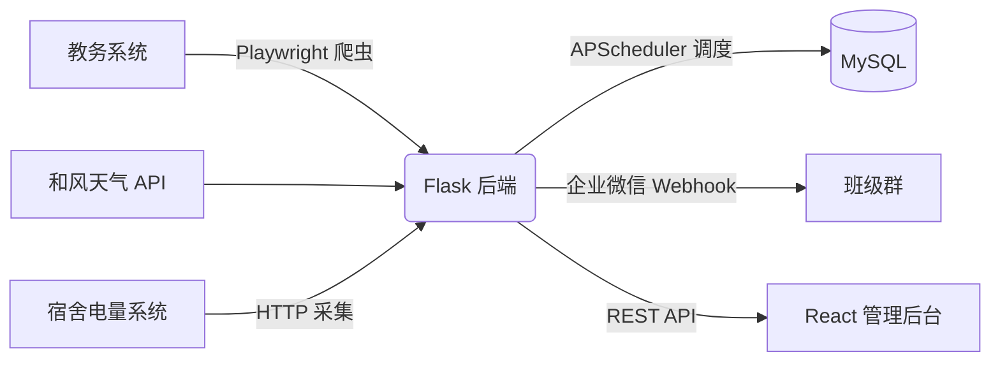

# 校园信息聚合与智能推送系统

[](https://github.com/CherryPainter/campus-info-system)
[](LICENSE)
[](https://github.com/CherryPainter/campus-info-system)
[](https://github.com/CherryPainter/campus-info-system)

> 一套「采集 → 聚合 → 主动推送」的校园信息中台：自动获取课表、天气、宿舍电量，并通过企业微信机器人主动推送到群，配套 React 管理后台统一展示与配置。
>
> 毕业设计项目 · 当前版本 `v6.12.1` · 已部署上线

---

## 目录

- [这是什么](#这是什么)
- [功能特性](#功能特性)
- [技术栈](#技术栈)
- [系统架构](#系统架构)
- [快速开始](#快速开始)
- [配置说明](#配置说明)
- [项目结构](#项目结构)
- [文档](#文档)
- [安全说明](#安全说明)
- [许可证](#许可证)

---

## 这是什么

学生每天要在多个系统间查课表、看天气、盯宿舍电量，信息分散、还得手动查。本项目把这些校园信息**自动采集、集中展示、主动推送**，让「上课前提醒」「天气预警」「低电量提醒」自动送达班级群，减少人工遗漏。

## 功能特性

- 课程自动获取 —— 定时抓取教务系统课表，按教学周推算「当前周次」，课前自动提醒
- 天气查询 —— 对接和风天气，实时 / 逐时天气 + 气象预警推送
- 宿舍电量 —— 电量采集、余额查询、低电量提醒
- 企业微信推送 —— 课程 / 天气 / 电量 / 自定义通知统一经群机器人推送
- 信息聚合后台 —— React 管理台一站式查看与配置，内置 MFA、IP 黑名单、会话管理等安全能力

---

## 技术栈

| 分层 | 技术 |
|---|---|
| 前端 | React 19 + TypeScript + Vite + Ant Design 5 |
| 后端 | Python + Flask 3.1 + SQLAlchemy 2.0 + 自研 JWT 双 Token 认证 |
| 数据库 | MySQL 8（utf8mb4） |
| 采集 | Playwright（Chromium 无头浏览器）+ 和风天气 API |
| 调度 | APScheduler |
| 部署 | Ubuntu + Nginx + Gunicorn（`preload_app`） |

---

## 系统架构



后端承担采集、聚合、调度与推送；前端通过 REST API 读写数据并配置策略；定时任务经 APScheduler 周期性拉取数据源，并通过企业微信机器人主动触达用户。

---

## 快速开始

### 环境要求

- Python 3.12+ · Node.js 22.x · MySQL 8.0+

### 后端

```bash
cd Push_System_Flask
python3 -m venv venv && source venv/bin/activate
pip install -r requirements.txt
playwright install chromium          # 爬虫用无头浏览器

cp .env.example .env                 # 编辑数据库、密钥等（见下）
python init_db.py                    # 初始化数据库（自动建表）
python run.py                        # 启动，默认 http://127.0.0.1:29528
```

### 前端

```bash
cd admin-frontend
npm install
npm run dev                          # 本地开发
# 或 npm run build 产出 dist/ 交给 Nginx 托管
```

---

## 配置说明

敏感配置全部通过 `.env` 注入（Flask 后端），前端构建期配置通过 `.env.local` 注入，二者均被 `.gitignore` 排除，**切勿提交**。

后端 `.env` 最少需要配置：

```ini
SECRET_KEY=<强随机字符串>            # JWT 签名，必须设置
DATABASE_HOST=localhost
DATABASE_USER=root
DATABASE_PASSWORD=<你的密码>
DATABASE_NAME=push_system
JWT_ADMIN_USERNAME=admin
JWT_ADMIN_PASSWORD=<初始管理员密码>
QWEATHER_*=<和风天气凭证>            # 需在和风天气官网申请
JWXT_USERNAME=<学号>                 # 教务系统账号（爬虫用）
JWXT_PASSWORD=<密码>
WECOM_WEBHOOK=<企业微信机器人 Webhook>
```

> 生产环境务必更换默认密码与密钥；`.env` 泄露等同于系统失守，请妥善保管并定期轮换。

---

## 项目结构

```
push_system/
├── admin-frontend/      前端（React 19 + Vite + Ant Design 5）
├── Push_System_Flask/   后端（Flask + 爬虫子系统）
│   ├── app/api/         接口路由（按蓝图划分，约 110 个接口）
│   ├── app/models/      数据模型（约 20 张表）
│   ├── app/services/    业务逻辑
│   └── app/cqie-course-timetable/  课表爬虫
├── docs/                项目文档（见下）
└── README.md            本文件
```

---

## 文档

按阅读深度，建议从本文件（概览）→ 后端 README（后端实现细节）→ 后端 docs 专题文档 → CHANGELOG（版本演进）：

- 后端详细技术文档 —— 后端分层架构、推送流水线、JWT 双 Token 认证、课表爬虫端到端、消息模板分发、登录安全信号感知（均含 mermaid 图）、数据入库管道与手动课保护等：[Push_System_Flask/README.md](Push_System_Flask/README.md)
- 后端部署与安全文档 —— DEPLOY_LINUX / DEPLOY_CHECKLIST / 安全配置指南 / 安全配置审计 等：[Push_System_Flask/docs/](Push_System_Flask/docs/)
- 参考文档（设计 / 验证，不纳入版本控制）—— 课表爬虫爬取与解析设计、课程表结构设计、爬取验证报告：[参考/](参考/)
- 变更记录 CHANGELOG —— 版本迭代与功能变更（单一真相源）：[CHANGELOG.md](CHANGELOG.md)

---

## 安全说明

- 所有密钥、密码、Token 仅存于 `.env`，不进入版本库。
- 管理后台启用 MFA、IP 黑名单、服务端会话管理与 JWT 闲置 / 绝对时效闸门。
- 生产部署请通过 Nginx 反向代理并启用 HTTPS，定期轮换密钥。

---

## 许可证

[MIT License](LICENSE) · © 2026 CherryPainter

> 毕业设计项目，仅供学习与技术交流。
